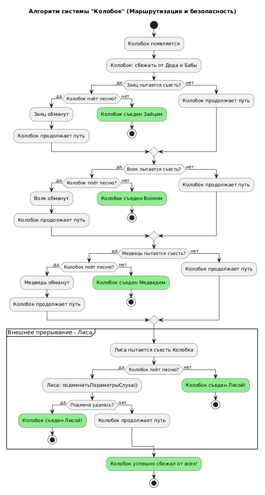

# Activity Diagram: Алгоритм системы "Колобок"

## Обзор
Эта диаграмма активности показывает алгоритм работы системы "Колобок" с точки зрения маршрутизации и безопасности.

## Описание потока
### Шаг 1: Начало маршрута
- Колобок появляется и сбегает от Деда и Бабы
### Шаг 2: Встреча с Зайцем
- Заяц пытается съесть Колобка
- Колобок использует защиту: спеть_песню()
- **Если песня успешна** — Заяц обманут, Колобок продолжает путь
- **Если нет** — Колобок съеден
### Шаг 3: Встреча с Волком
- Волк пытается съесть Колобка
- Колобок использует защиту: спеть_песню()
- **Если песня успешна** — Волк обманут, Колобок продолжает путь
- **Если нет** — Колобок съеден
### Шаг 4: Встреча с Медведем
- Медведь пытается съесть Колобка
- Колобок использует защиту: спеть_песню()
- **Если песня успешна** — Медведь обманут, Колобок продолжает путь
- **Если нет** — Колобок съеден
### Шаг 5: Внешнее прерывание — Лиса
- Лиса пытается съесть Колобка
- Колобок использует защиту: спеть_песню()
- Лиса применяет атаку: подменитьПараметрыСлуха()
- **Если подмена удалась** — Колобок съеден Лисой
- **Если нет** — Колобок успешно завершает маршрут

## Точки принятия решений
| Условие                          | Результат                          |
|----------------------------------|------------------------------------|
| Колобок поёт песню (Заяц)        | Успех → продолжает путь / Неудача → съеден |
| Колобок поёт песню (Волк)        | Успех → продолжает путь / Неудача → съеден |
| Колобок поёт песню (Медведь)     | Успех → продолжает путь / Неудача → съеден |
| Лиса: подменитьПараметрыСлуха()  | Успех → Колобок съеден / Неудача → продолжает путь |

## Диаграмма


```plantuml
@startuml
skinparam conditionStyle inside
title Алгоритм системы "Колобок" (Маршрутизация и безопасность)

start

:Колобок появляется;
:Колобок: сбежать от Деда и Бабы;

if (Заяц пытается съесть?) then (да)
    if (Колобок поёт песню?) then (да)
        :Заяц обманут;
        :Колобок продолжает путь;
    else (нет)
        :Колобок съеден Зайцем; <<#lightgreen>>
        stop
    endif
else (нет)
    :Колобок продолжает путь;
endif

if (Волк пытается съесть?) then (да)
    if (Колобок поёт песню?) then (да)
        :Волк обманут;
        :Колобок продолжает путь;
    else (нет)
        :Колобок съеден Волком; <<#lightgreen>>
        stop
    endif
else (нет)
    :Колобок продолжает путь;
endif

if (Медведь пытается съесть?) then (да)
    if (Колобок поёт песню?) then (да)
        :Медведь обманут;
        :Колобок продолжает путь;
    else (нет)
        :Колобок съеден Медведем; <<#lightgreen>>
        stop
    endif
else (нет)
    :Колобок продолжает путь;
endif

partition "Внешнее прерывание - Лиса" {
    :Лиса пытается съесть Колобка;
    if (Колобок поёт песню?) then (да)
        :Лиса: подменитьПараметрыСлуха();
        if (Подмена удалась?) then (да)
            :Колобок съеден Лисой!; <<#lightgreen>>
            stop
        else (нет)
            :Колобок продолжает путь;
        endif
    else (нет)
        :Колобок съеден Лисой!; <<#lightgreen>>
        stop
    endif
}

:Колобок успешно сбежал от всех!; <<#lightgreen>>
stop

@enduml
