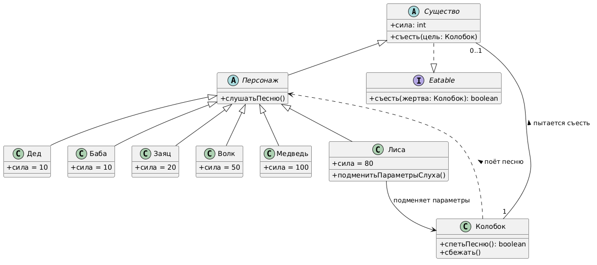

# Class Diagram: Колобок

## Обзор
Эта диаграмма классов показывает объектно-ориентированную структуру системы сказки "Колобок" с акцентом на маршрутизацию и безопасность.

## Иерархия классов
### Иерархия существ
| Class      | Type      | Attributes          | Methods                          |
|------------|-----------|---------------------|----------------------------------|
| Существо   | Abstract  | + сила: int         | + съесть(цель: Колобок)          |
| Персонаж   | Abstract  | extends Существо    | + слушатьПесню()                 |
| Дед        | Concrete  | + сила = 10         | extends Персонаж                 |
| Баба       | Concrete  | + сила = 10         | extends Персонаж                 |
| Заяц       | Concrete  | + сила = 20         | extends Персонаж                 |
| Волк       | Concrete  | + сила = 50         | extends Персонаж                 |
| Медведь    | Concrete  | + сила = 100        | extends Персонаж                 |
| Лиса       | Concrete  | + сила = 80         | extends Персонаж, + подменитьПараметрыСлуха() |

### Главный герой
| Class    | Type     | Attributes | Methods                     |
|----------|----------|------------|-----------------------------|
| Колобок  | Concrete | -          | + спетьПесню(): boolean, + сбежать() |

### Интерфейс
| Interface | Methods                          |
|-----------|----------------------------------|
| Eatable   | + съесть(жертва: Колобок): boolean |

## Связи
- **Существо ..|> Eatable**: Реализует интерфейс
- **Колобок "1" -- "0..1" Существо**: Пытается съесть
- **Колобок ..> Персонаж**: Поёт песню
- **Лиса --> Колобок**: Подменяет параметры

## Шаблоны проектирования
### Стратегия защиты
Колобок использует метод `спетьПесню()` как основную защиту от вызова `съесть()`.  
Метод возвращает `false` для большинства зверей.  
Лиса обходит защиту с помощью метода `подменитьПараметрыСлуха()`.

## Заметки
- Все звери (**Дед, Баба, Заяц, Волк, Медведь, Лиса**) являются потомками `Персонаж` и реализуют интерфейс `Eatable`
- **Колобок** — единственный класс, который защищается методом `спетьПесню()`
- **Лиса** — единственный зверь, способный обойти защиту Колобка
- Сила зверей не влияет напрямую на результат (в отличие от Курочки Рябы), важна только успешность песни или подмены параметров

## Диаграмма


```plantuml
@startuml
skinparam classAttributeIconSize 0
skinparam shadowing false

abstract class Существо {
    + сила: int
    + съесть(цель: Колобок)
}

abstract class Персонаж extends Существо {
    + слушатьПесню()
}

class Дед extends Персонаж {
    + сила = 10
}

class Баба extends Персонаж {
    + сила = 10
}

class Заяц extends Персонаж {
    + сила = 20
}

class Волк extends Персонаж {
    + сила = 50
}

class Медведь extends Персонаж {
    + сила = 100
}

class Лиса extends Персонаж {
    + сила = 80
    + подменитьПараметрыСлуха()
}

class Колобок {
    + спетьПесню(): boolean
    + сбежать()
}

interface Eatable {
    + съесть(жертва: Колобок): boolean
}

Существо ..|> Eatable

Колобок "1" -- "0..1" Существо : пытается съесть >
Колобок ..> Персонаж : поёт песню >
Лиса --> Колобок : подменяет параметры

@enduml
