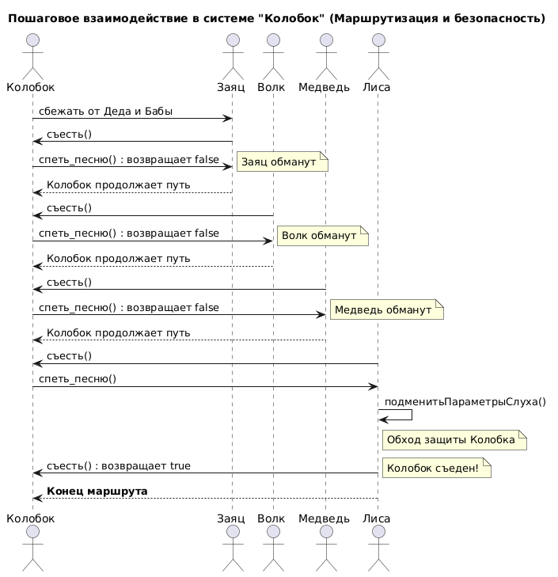

# Sequence Diagram: Взаимодействие в системе "Колобок"

## Обзор
Эта диаграмма последовательности показывает пошаговое взаимодействие между Колобком и зверями в системе "Колобок" с точки зрения маршрутизации и безопасности.

## Актеры и участники
| Актер/Участник | Описание |
|-------------------|-------------|
| Колобок       | Главный герой, объект с защитой `спеть_песню()` |
| Заяц          | Первый зверь на маршруте |
| Волк          | Второй зверь на маршруте |
| Медведь       | Третий зверь на маршруте |
| Лиса          | Четвёртый зверь, обладает специальной атакой |

## Interaction Steps
### Шаг 1: Начало маршрута
- Колобок сбегает от Деда и Бабы и начинает движение
### Шаг 2: Встреча с Зайцем
- Заяц вызывает метод `съесть()`
- Колобок защищается методом `спеть_песню()` → возвращает `false`
- Заяц обманут, Колобок продолжает путь
### Шаг 3: Встреча с Волком
- Волк вызывает метод `съесть()`
- Колобок защищается методом `спеть_песню()` → возвращает `false`
- Волк обманут, Колобок продолжает путь
### Шаг 4: Встреча с Медведем
- Медведь вызывает метод `съесть()`
- Колобок защищается методом `спеть_песню()` → возвращает `false`
- Медведь обманут, Колобок продолжает путь
### Шаг 5: Встреча с Лисой (критический момент)
- Лиса вызывает метод `съесть()`
- Колобок начинает петь песню
- Лиса применяет атаку `подменитьПараметрыСлуха()`
- Метод `съесть()` возвращает `true`
- Колобок съеден

## Ключевые наблюдения
1. Колобок успешно защищается от Зайца, Волка и Медведя с помощью метода `спеть_песню()` (возвращает `false`)
2. Лиса — единственный зверь, который может обойти защиту Колобка
3. Подмена параметров приёма звука позволяет Лисы сделать `съесть()` успешным
4. Маршрутизация Колобка завершается неудачей только на Лису

## Диаграмма


```plantuml
@startuml
title Пошаговое взаимодействие в системе "Колобок" (Маршрутизация и безопасность)

actor "Колобок" as Kolobok
actor "Заяц" as Hare
actor "Волк" as Wolf
actor "Медведь" as Bear
actor "Лиса" as Fox

' 1. Начало маршрута
note over Kolobok: Начало маршрута

' 2. Заяц
Hare -> Kolobok: съесть()
Kolobok -> Hare: спеть_песню() : возвращает false
note right: Заяц обманут
Hare --> Kolobok: Колобок продолжает путь

' 3. Волк
Wolf -> Kolobok: съесть()
Kolobok -> Wolf: спеть_песню() : возвращает false
note right: Волк обманут
Wolf --> Kolobok: Колобок продолжает путь

' 4. Медведь
Bear -> Kolobok: съесть()
Kolobok -> Bear: спеть_песню() : возвращает false
note right: Медведь обманут
Bear --> Kolobok: Колобок продолжает путь

' 5. Лиса - критический момент
Fox -> Kolobok: съесть()
Kolobok -> Fox: спеть_песню()
Fox -> Fox: подменитьПараметрыСлуха()
note right of Fox: Обход защиты Колобка
Fox -> Kolobok: съесть() : возвращает true
note right #FFAAAA: Колобок съеден!

' Финал
Fox --> Kolobok: **Конец маршрута**

@enduml
