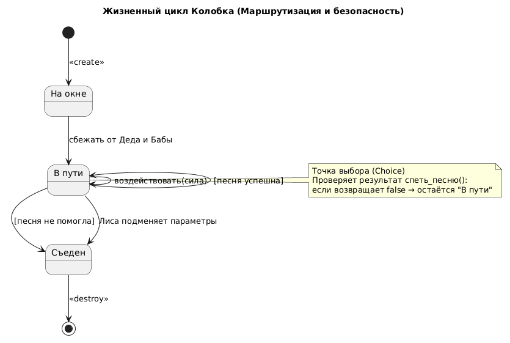

# State Diagram: Жизненный цикл Колобка

## Обзор
Эта диаграмма состояний показывает жизненный цикл Колобка с точки зрения маршрутизации и безопасности.

## Состояния
| Состояние   | Описание                          | Цвет фона |
|-------------|-----------------------------------|-----------|
| На окне     | Начальное положение Колобка       | Default   |
| В пути      | Колобок перемещается между зверями| Default   |
| Съеден      | Финальное состояние (поражение)   | Pink      |

## Переходы состояний
### Начальное состояние
- [*] --> На окне : <<create>>
### Основной переход
- На окне --> В пути : сбежать от Деда и Бабы
### Переход: воздействовать(сила) / спеть_песню()
- Из В пути в точку выбора (c)
### Логика точки выбора
| Условие                        | Следующее состояние      |
|--------------------------------|--------------------------|
| песня успешна (возвращает false) | В пути (продолжает маршрут) |
| песня не помогла или Лиса обманула | Съеден                |

### Конечное состояние
- Съеден --> [*] : <<destroy>>

## Ключевые моменты
- **Точка выбора (c)**: Проверяет результат метода `спетьПесню()`
  - Если песня успешна — Колобок остаётся в состоянии "В пути" и продолжает маршрутизацию
  - Если песня не помогла или Лиса применила `подменитьПараметрыСлуха()` — переходит в состояние "Съеден"
- **Лиса** — единственный зверь, способный изменить результат проверки и съесть Колобка
- Большинство зверей (Заяц, Волк, Медведь) получают `false` от метода `спетьПесню()` и не могут съесть Колобка

## Диаграмма


```plantuml
@startuml
skinparam state {
  BackgroundColor<<Eaten>> #pink
}
skinparam shadowing false

title STATE
title Жизненный цикл Колобка (Маршрутизация и безопасность)

state "На окне" as OnWindow
state "В пути" as InMotion
state "Съеден" as Eaten <<Eaten>>

[*] --> OnWindow : <<create>>

OnWindow --> InMotion : сбежать от Деда и Бабы

InMotion --> c : спеть_песню() / воздействовать(сила)

state c <<choice>>

c --> InMotion : [песня успешна]
c --> Eaten : [песня не помогла]

InMotion --> Eaten : Лиса подменяет параметры

Eaten --> [*] : <<destroy>>

note right of c
  **Точка выбора (Choice)**
  Проверяет результат спеть_песню():
  если возвращает false → остаётся "В пути"
  если Лиса обманула → "Съеден"
end note

note right of Eaten
  Финальное состояние.
  Колобок съеден.
  Маршрутизация завершена неудачей.
end note

@enduml
