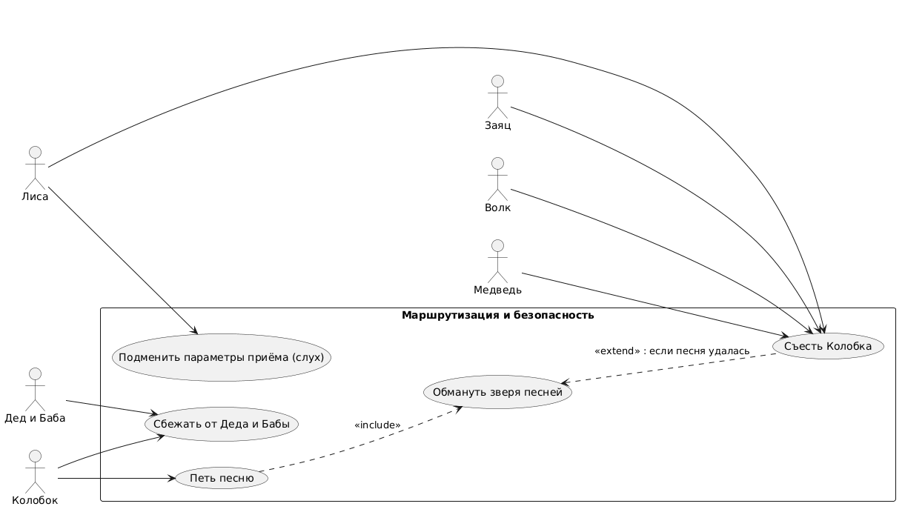

# Use Case Diagram: Маршрутизация и безопасность

## Актеры
| Актер       | Описание                  |
|-------------|---------------------------|
| Дед и Баба  | Дедушка и Бабушка        |
| Колобок     | Главный герой             |
| Заяц        | Первый зверь              |
| Волк        | Второй зверь              |
| Медведь     | Третий зверь              |
| Лиса        | Четвёртый зверь (антогонист) |

## Варианты использования
### Пакет: Маршрутизация и безопасность
| Вариант использования              | Описание                                      |
|------------------------------------|-----------------------------------------------|
| Сбежать от Деда и Бабы            | Начало маршрута Колобка                       |
| Петь песню                         | Основной метод защиты Колобка                 |
| Обмануть зверя песней              | Успешное применение защиты                    |
| Подменить параметры приёма (слух)  | Атака Лисы на защиту Колобка                  |
| Съесть Колобка                     | Попытка поедания Колобка зверем               |

## Связи
### Актер к варианту использования
- **Дед и Баба** выполняют: Сбежать от Деда и Бабы
- **Колобок** выполняет: Сбежать от Деда и Бабы
- **Колобок** выполняет: Петь песню
- **Заяц**, **Волк**, **Медведь** и **Лиса** выполняют: Съесть Колобка
- **Лиса** выполняет: Подменить параметры приёма (слух)

### Отношения Extend/Include
- **Петь песню** →→ **Обмануть зверя песней** (<<include>>)
- **Обмануть зверя песней** ←← **Съесть Колобка** (<<extend>>): если песня удалась

## Диаграмма


```plantuml
@startuml
left to right direction
skinparam packageStyle rectangle

actor "Дед и Баба" as Grandparents
actor "Колобок" as Kolobok
actor "Заяц" as Hare
actor "Волк" as Wolf
actor "Медведь" as Bear
actor "Лиса" as Fox

package "Маршрутизация и безопасность" {
  usecase "Сбежать от Деда и Бабы" as EscapeGrandparents
  usecase "Петь песню" as SingSong
  usecase "Обмануть зверя песней" as DeceiveWithSong
  usecase "Подменить параметры приёма (слух)" as SpoofHearing
  usecase "Съесть Колобка" as EatKolobok
}

' Связи актёров с use cases
Grandparents --> EscapeGrandparents

Kolobok --> EscapeGrandparents
Kolobok --> SingSong

Hare --> EatKolobok
Wolf --> EatKolobok
Bear --> EatKolobok
Fox --> EatKolobok
Fox --> SpoofHearing

' Связи между use cases
SingSong ..> DeceiveWithSong : <<include>>
DeceiveWithSong <.. EatKolobok : <<extend>> : если песня удалась

@enduml
